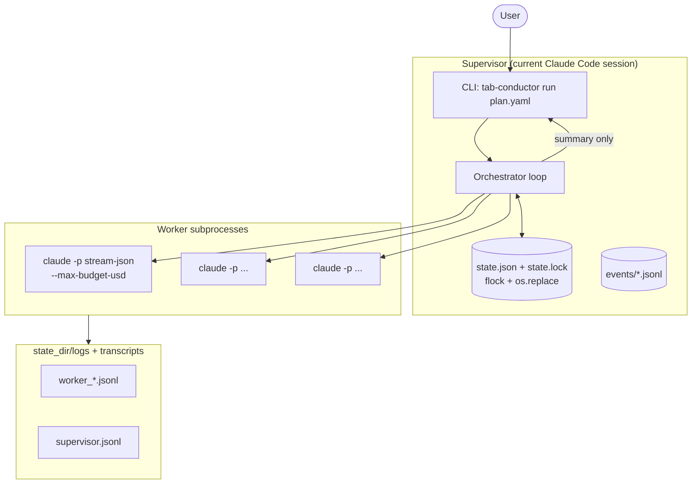

# tab-conductor

[](https://github.com/hinanohart/tab-conductor/actions/workflows/ci.yml)
[](https://github.com/hinanohart/tab-conductor)
[](https://pypi.org/project/tab-conductor/)
[](LICENSE)
[](https://www.python.org/downloads/)

Stable, observable multi-tab orchestrator skill for Claude Code.

tab-conductor spawns N parallel `claude -p` worker subprocesses, coordinates them through a shared JSON state file, and enforces cost caps, secret denial, and stuck-process detection — all without experimental flags, tmux workarounds, or process-level hacks.

> **Disclaimer**: This project is not affiliated with or endorsed by Anthropic. It uses the Claude CLI (`claude -p`) as a subprocess backend. Anthropic's official multi-agent solution is [Agent Teams](https://docs.anthropic.com/en/docs/build-with-claude/agents) (currently experimental).

---

## Why tab-conductor?

| Differentiator | Detail |
|---|---|
| **Persistent JSON state** | Every run leaves `state.json` + structured logs — readable after crash, resumable, post-mortem ready |
| **Cost + secret guardrails** | Per-worker `$1` and global `$5` cap with SIGINT→SIGTERM→SIGKILL escalation; secret deny-list scrubs API keys from all output |
| **No experimental flags** | Works with any `claude` CLI build that supports `claude -p --output-format stream-json`; no `--dangerously-*` required |
| **Failure museum** | Failed runs preserved under `.orchestrator/` (never deleted); `bugreport` command packages everything as redacted tar.gz |
| **Skill bundle** | Ships as a Claude Code skill (`~/.claude/skills/tab-conductor/`) with progressive disclosure — SKILL.md ≤ 100 lines, full references behind links |

---

## Comparison

| Feature | **tab-conductor** | Anthropic Agent Teams | claude_code_agent_farm | claude-squad |
|---|---|---|---|---|
| Stable (no experimental flag) | Yes | No (experimental) | Yes | Yes |
| Persistent JSON state | Yes | No | Partial | No |
| Cost cap enforcement | Yes (per-worker + global) | API-level only | No | No |
| Secret deny-list | Yes (regex scrub) | No | No | No |
| Stuck detection | Yes (3-layer) | Unknown | No | No |
| Failure museum / bugreport | Yes | No | No | No |
| Claude Code Skill bundle | Yes | N/A | No | No |
| DAG task plans (YAML) | Yes | No | No | Partial |
| HMAC state signing | Optional | No | No | No |
| OS support | Linux + macOS + WSL2 | Linux | Linux | Linux |

See [docs/COMPARISON.md](docs/COMPARISON.md) for detailed feature-by-feature analysis.

---

## Install

```bash
# 1. Clone and create venv
git clone https://github.com/hinanohart/tab-conductor.git
cd tab-conductor
uv venv && source .venv/bin/activate
uv pip install -e ".[dev]"

# 2. Install as Claude Code skill
bash scripts/install_skill.sh
```

---

## 5-Minute Quickstart

```bash
# Step 1: Validate a plan (no API key needed)
tab-conductor validate examples/scenario_a_refactor/plan.yaml

# Step 2: Run with mock workers (no API key needed, no subprocesses)
tab-conductor run examples/scenario_a_refactor/plan.yaml \
    --mock --max-parallel 3 --state-dir .orchestrator/demo

# Step 3: Watch progress in another terminal
tab-conductor watch <RUN_ID>

# Step 4: Inspect final state
tab-conductor show <RUN_ID>
```

**Example plan.yaml:**

```yaml
name: "refactor-utils"
description: "Lint + type + verify pipeline"
max_parallel: 3

tasks:
  - id: lint
    kind: refactor
    prompt: "Run ruff on src/ and fix all auto-fixable issues."
    priority: 5
    max_retries: 2

  - id: types
    kind: refactor
    prompt: "Run mypy --strict on src/ and fix all type errors."
    priority: 5
    max_retries: 2

  - id: verify
    kind: verify
    prompt: "Run pytest -x and confirm all tests pass."
    priority: 9
    depends_on: [lint, types]
    max_retries: 1
```

> Cost caps and HMAC signing are configured at run time via CLI flags
> (`--cap-usd-per-worker`, `--cap-usd-global`, `--require-hmac`), not
> inside the plan file. See `tab-conductor run --help`.

---

## Architecture



See [docs/ARCHITECTURE.md](docs/ARCHITECTURE.md) for full implementation notes, sequence diagrams, and state.json schema examples.

---

## Core Commands

| Command | Description |
|---|---|
| `run <plan.yaml>` | Parse plan, spawn workers, supervise to completion |
| `ls` | List all runs under the state root directory |
| `show <RUN_ID>` | Pretty-print current state.json for a run |
| `watch <RUN_ID>` | Live-refresh progress every 1 second |
| `kill <RUN_ID>` | Send SIGTERM to all workers of a run |
| `bugreport <RUN_ID>` | Package state + logs as tar.gz with secrets redacted |
| `validate <plan.yaml>` | Validate plan YAML without running (safe dry-run) |
| `version` | Print version and exit |

---

## Plan Format

```yaml
# top-level metadata (all optional except "tasks")
name: "my-run"                      # display name
description: "..."                  # free-form description
max_parallel: 3                     # concurrent worker limit (overridden by --max-parallel)

tasks:
  - id: task1                       # unique identifier, required
    kind: general                   # arbitrary string label, default "general"
    prompt: "..."                   # instruction passed to the worker, required
    priority: 5                     # 0..9, higher = runs first within ready set, default 5
    depends_on: []                  # list of task IDs that must complete first, default []
    max_retries: 2                  # 0..10, default 2
```

Run-time guarantees (cost cap, HMAC, max parallel) are configured via CLI
flags on `tab-conductor run`, not via fields inside `plan.yaml`. See
`tab-conductor run --help` for the authoritative list.

---

## Safety Guarantees

| Guarantee | Implementation |
|---|---|
| **Cost cap** | Per-worker `--max-budget-usd`; global SIGTERM when `cost_usd_total >= cap` |
| **Secret deny** | Regex scrub of Anthropic (`sk-ant-…`), OpenAI/generic (`sk-…`), GitHub (`ghp_/gho_/ghu_/ghs_/ghr_…`), AWS (`AKIA…`, `ASIA…`), `key=value` pairs, and base64-like 40+ char strings before any bundled write; deny-list path read for `.env*`, `*.pem`, `~/.ssh/` private keys, `~/.aws/`, `~/.kaggle/`, etc. |
| **Stuck detection** | 3-layer: heartbeat timeout → capture hash stall → pgrep liveness |
| **Atomic state** | `flock(state.lock)` + `os.replace(state.json.tmp, state.json)` — no partial writes |
| **Failure museum** | `.orchestrator/` never auto-deleted; `bugreport` packages with `--redact` |

See [docs/SECURITY_THREAT_MODEL.md](docs/SECURITY_THREAT_MODEL.md) for full 4-layer threat model.

---

## Examples

| Scenario | Description |
|---|---|
| [scenario_a_refactor](examples/scenario_a_refactor/) | Parallel lint + type-check + test verification |
| [scenario_b_translate](examples/scenario_b_translate/) | Concurrent docstring translation across modules |
| [scenario_c_multi_provider](examples/scenario_c_multi_provider/) | Multi-strategy approach to a single problem |
| [scenario_d_pipeline](examples/scenario_d_pipeline/) | DAG pipeline with sequential dependencies |
| [scenario_e_repro](examples/scenario_e_repro/) | Parallel bug reproduction with 3 hypotheses |

---

## Status: alpha (v0.1.0)

This project is in **alpha**. The plan schema, state schema, and CLI flags are stabilizing but may change before v1.0.

- Performance benchmarks: see [docs/PERFORMANCE.md](docs/PERFORMANCE.md) (placeholders; measure-then-update)
- Changelog: see [CHANGELOG.md](CHANGELOG.md)

---

## Contributing

See [CONTRIBUTING.md](CONTRIBUTING.md).

---

## License

MIT © 2026 hinanohart

SPDX-License-Identifier: MIT

---

## Acknowledgements

- [Anthropic Agent Teams](https://docs.anthropic.com/en/docs/build-with-claude/agents) — the official multi-agent solution this project complements
- [Dicklesworthstone/claude_code_agent_farm](https://github.com/Dicklesworthstone/claude_code_agent_farm) — inspiration for multi-agent coordination patterns
- [smtg-ai/claude-squad](https://github.com/smtg-ai/claude-squad) — inspiration for supervisor/worker architecture
