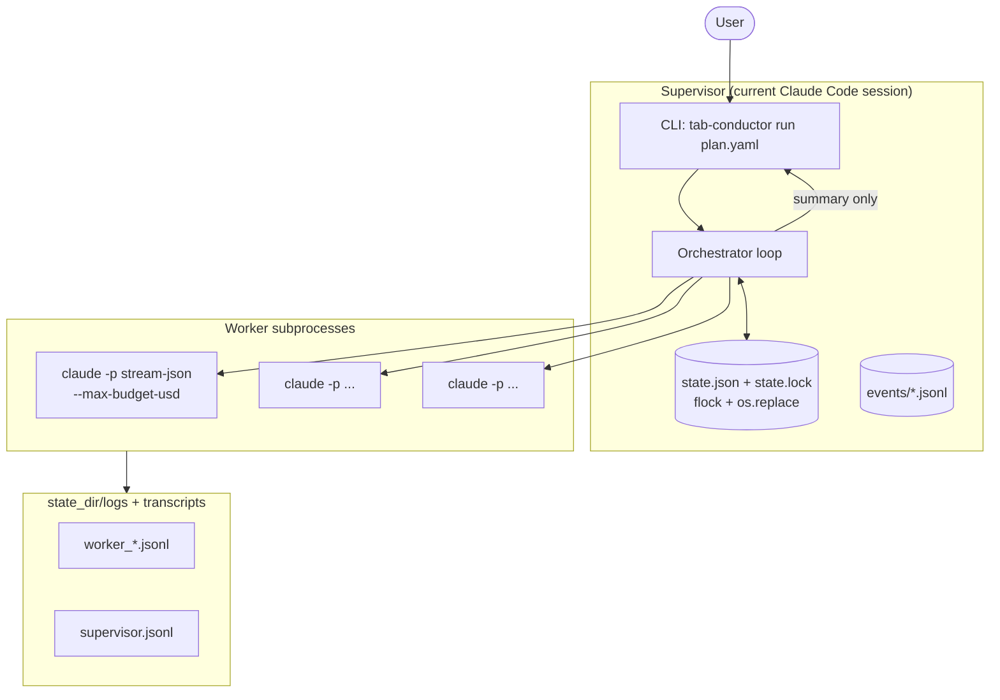
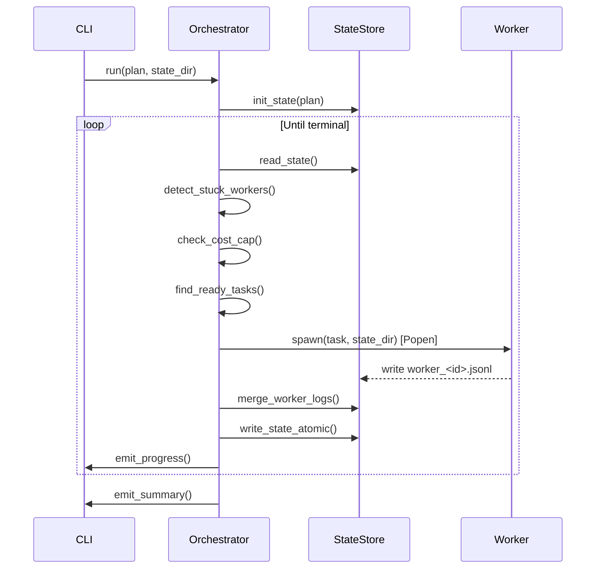
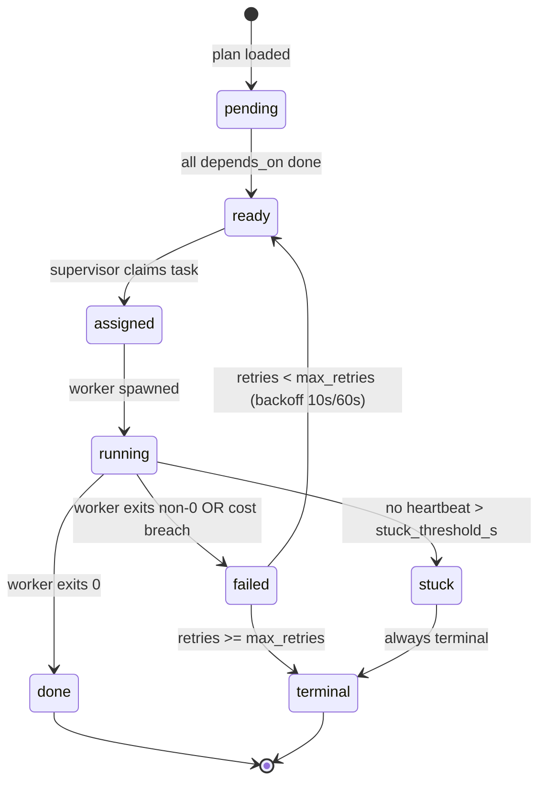

# tab-conductor Architecture

Extended implementation reference. See also [skill/references/architecture.md](../skill/references/architecture.md) for the canonical system diagram and supervisor loop pseudocode.

---

## System Diagram



---

## IPC Protocol

Communication between supervisor and workers uses three mechanisms:

| Mechanism | Direction | Purpose |
|---|---|---|
| `state.json` | bidirectional | Single source of truth for all task/worker status |
| `state.lock` (flock/lockf) | supervisor-owned | Prevent concurrent writes; 5s timeout |
| `events/*.jsonl` | append-only | Immutable event log per run |

Workers **never** write `state.json` directly. They write to their own `worker_<id>.jsonl` log. The supervisor polls these logs and merges updates into `state.json`.

### Atomic State Write Sequence

```
1. open(state.lock, O_CREAT|O_RDWR)
2. flock(fd, LOCK_EX|LOCK_NB)  -- Linux
   lockf(fd, F_LOCK, 0)        -- macOS (POSIX)
3. read state.json → dict
4. apply mutation
5. json.dumps → write state.json.tmp
6. os.replace(state.json.tmp, state.json)   # atomic rename on POSIX
7. flock(fd, LOCK_UN)
```

`os.replace` is atomic on all POSIX filesystems (Linux ext4, macOS APFS, WSL2 VolFS). It is **not** atomic on Windows NTFS via 9P — do not place `state_dir` under `/mnt/c/` on WSL2.

---

## state.json Schema

Example of a terminal state.json:

```json
{
  "$schema": "https://tab-conductor.schema/state/v1",
  "schema_version": "1",
  "run_id": "01HXYZ...",
  "status": "done",
  "created_at": "2026-04-27T00:00:00Z",
  "updated_at": "2026-04-27T00:01:23Z",
  "cost_usd_total": 0.043,
  "cost_cap_usd_global": 5.0,
  "tasks": [
    {
      "id": "lint",
      "status": "done",
      "prompt": "Run ruff on src/ ...",
      "depends_on": [],
      "kind": "task",
      "retries": 0,
      "max_retries": 2,
      "cost_usd": 0.021,
      "worker_id": "01HXYZ_W1",
      "started_at": "2026-04-27T00:00:01Z",
      "finished_at": "2026-04-27T00:00:45Z",
      "exit_code": 0,
      "last_error": null
    }
  ],
  "workers": [
    {
      "id": "01HXYZ_W1",
      "pid": 12345,
      "task_id": "lint",
      "status": "done",
      "heartbeat_ts": "2026-04-27T00:00:44Z",
      "cost_usd": 0.021
    }
  ],
  "hmac_signature": null
}
```

The schema is validated against JSON Schema 2020-12 with `unevaluatedProperties: false` on every read and write. See `src/tab_conductor/schema.py` for the full schema definition.

---

## Supervisor Loop — Sequence Diagram



---

## Task Lifecycle



---

## Worker Lifecycle

1. **spawning** — `subprocess.Popen` called; PID recorded; status `spawning`
2. **running** — first heartbeat received; status `running`
3. **done** — process exits 0; final cost/token snapshot parsed
4. **failed** — process exits non-zero; `last_error` set; retry counter incremented
5. **stuck** — no heartbeat for `stuck_threshold_s` (default 120s); SIGTERM → SIGKILL
6. **killed** — SIGTERM sent by operator via `tab-conductor kill`; status `terminal`

---

## Retry Policy

| Attempt | Delay before retry |
|---|---|
| 1st retry | 10 seconds |
| 2nd retry | 60 seconds |
| 3rd+ | terminal — no further retry |

Default `max_retries: 2`. Override per-task in plan YAML. `kind: "verify"` tasks benefit from `max_retries: 1`.

---

## Cost Cap Escalation

| Level | Threshold | Action |
|---|---|---|
| Warning | 80% of global cap | Log warning; continue |
| Soft halt | 100% of global cap | Stop dispatching new tasks; running workers finish |
| Hard halt | 110% of global cap | SIGTERM all workers; run marked `halted` |

Defaults: per-worker `$1.00`, global `$5.00`.

---

## Module Map

| Module | Responsibility |
|---|---|
| `cli.py` | Click entry point; 8 subcommands |
| `orchestrator.py` | Supervisor loop; task dispatch; worker lifecycle |
| `runner.py` | Subprocess spawn; stream-json parse; heartbeat inject |
| `state.py` | Atomic read/write; flock (Linux) / lockf (macOS); HMAC sign/verify |
| `plan_parser.py` | YAML load; DAG validation; cycle detection |
| `cost_guard.py` | Per-worker and global budget enforcement |
| `secret_filter.py` | Regex scrub of secrets before any write |
| `stuck_detector.py` | 3-layer stuck detection: heartbeat / hash / pgrep |
| `schema.py` | JSON Schema 2020-12 definitions; strict validation |
| `hmac_signer.py` | HMAC-SHA256 state signing / verification |
| `query.py` | Read-only queries for `ls`, `show`, `watch` |
| `tmux_dashboard.py` | Optional tmux pane management (graceful fallback) |
| `logging_config.py` | Structured JSON logging setup |
| `ulid.py` | ULID generation for run / worker IDs |
| `exceptions.py` | Domain exception hierarchy |

---

## Directory Layout

```
state_dir/                  # default: ~/.tab-conductor/runs/<RUN_ID>/
  state.json                # single source of truth
  state.lock                # flock sentinel (never read, only locked)
  events/
    <ULID>.jsonl            # per-event append-only log
  logs/
    supervisor.jsonl        # supervisor structured log
    worker_<id>.jsonl       # per-worker output log
  transcripts/
    worker_<id>.md          # human-readable conversation transcript
```

---

## WSL2 Caveats

### 1. `XDG_RUNTIME_DIR` may be unset

tmux requires `XDG_RUNTIME_DIR`. If unset, tab-conductor falls back to subprocess-only mode automatically. Add `export XDG_RUNTIME_DIR=/run/user/$(id -u)` to `.bashrc`.

### 2. Do NOT place `state_dir` under `/mnt/c/`

Windows NTFS via 9P does not support `fcntl.flock`. All state must reside on the Linux ext4 filesystem (e.g. `~/`).

### 3. `SIGCHLD` delivery under WSL2 kernel < 6.1

The supervisor uses polling (`is_alive(pid)`) rather than `SIGCHLD` handlers to detect worker exit. This is intentional — WSL2 kernels before 6.1 had inconsistent SIGCHLD delivery.
