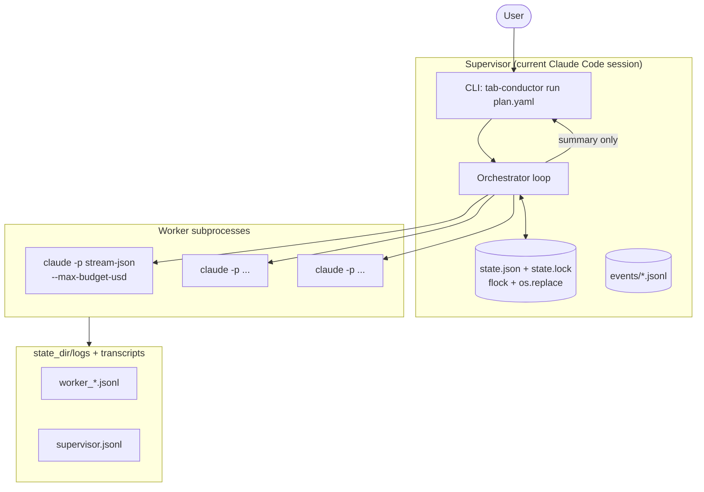
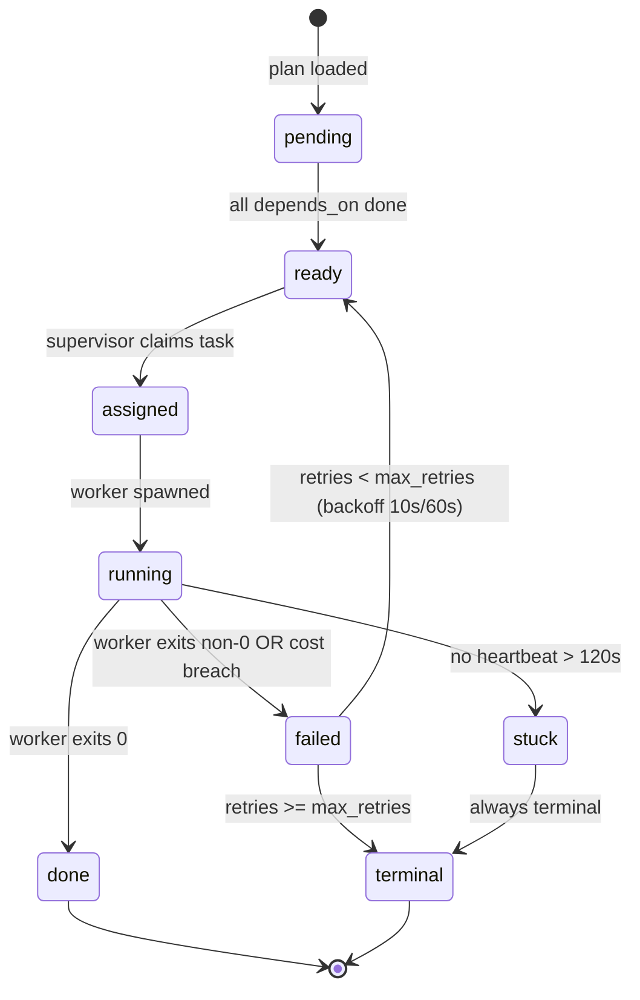

# tab-conductor Architecture

## Overview

tab-conductor runs a **supervisor loop** inside the current Claude Code session. Workers are spawned as child subprocesses (`claude -p --output-format stream-json`) and communicate back to the supervisor exclusively through a shared `state.json` file and structured log files. No in-process queues or sockets are used — everything is observable via plain files.

---

## System Diagram



---

## IPC Overview

Communication between the supervisor and workers uses **three mechanisms**:

| Mechanism | Direction | Purpose |
|-----------|-----------|---------|
| `state.json` | bidirectional | Single source of truth for all task/worker status |
| `state.lock` (flock) | supervisor-owned | Prevent concurrent writes; 5s timeout |
| `events/*.jsonl` | append-only | Immutable event log per run |

### Atomic State Write

```
1. acquire flock(state.lock, LOCK_EX, timeout=5s)
2. read current state.json → dict
3. apply mutation
4. write to state.json.tmp (same filesystem)
5. os.replace(state.json.tmp, state.json)   # atomic on POSIX
6. release flock
```

Workers never write `state.json` directly. They write to their own `worker_<id>.jsonl` log. The supervisor polls these logs and merges updates into `state.json`.

---

## Supervisor Loop Pseudocode

```python
def supervisor_loop(plan, state_dir, max_parallel, cost_cap_global):
    state = init_state(plan)
    while not is_terminal(state):
        state = read_state(state_dir)

        # 1. Detect stuck workers
        for w in state.workers:
            if w.status == "running" and elapsed(w.heartbeat_ts) > STUCK_THRESHOLD_S:
                kill_worker(w)
                state = mark_stuck(state, w)

        # 2. Enforce global cost cap
        if state.cost_usd_total >= cost_cap_global:
            halt_all(state)
            break

        # 3. Dispatch ready tasks
        ready = [t for t in state.tasks if t.status == "ready"
                 and len(active_workers(state)) < max_parallel]
        for task in sorted(ready, key=lambda t: -t.priority):
            worker = spawn_worker(task, state_dir)
            state = assign_task(state, task, worker)

        # 4. Collect completed workers
        for w in state.workers:
            if w.status == "running" and not is_alive(w.pid):
                outcome = parse_worker_log(w)
                state = record_outcome(state, w, outcome)

        # 5. Persist state atomically
        write_state_atomic(state, state_dir)
        time.sleep(POLL_INTERVAL_S)

    write_final_state(state, state_dir)
    emit_summary(state)
```

---

## Task Lifecycle



---

## Worker Lifecycle

1. **spawning** — `subprocess.Popen` called; PID recorded; status set to `spawning`
2. **running** — first heartbeat received from worker log; status advances to `running`
3. **done** — process exits 0; final cost/token snapshot parsed from log
4. **failed** — process exits non-zero; `last_error` set; retry counter incremented
5. **stuck** — no heartbeat for `STUCK_THRESHOLD_S` (default 120s); SIGTERM sent; transitions to `terminal`
6. **killed** — SIGTERM sent by operator via `tab-conductor kill`; transitions to `terminal`

---

## Retry Policy

| Attempt | Delay before retry |
|---------|-------------------|
| 1st retry | 10 seconds |
| 2nd retry | 60 seconds |
| 3rd+ | terminal — no further retry |

Default `max_retries: 2` per task. Override per-task in plan YAML. `kind: "verify"` tasks often benefit from `max_retries: 1`.

---

## Cost Cap

Three escalation levels:

| Level | Threshold | Action |
|-------|-----------|--------|
| Warning | 80% of global cap | Log warning; continue |
| Soft halt | 100% of global cap | Stop dispatching new tasks; running workers finish |
| Hard halt | 110% of global cap | SIGTERM all workers; run marked `halted` |

Defaults: per-worker `$1.00`, global `$5.00`. Override via `--cost-cap-usd-global` and `--cost-cap-usd-worker` CLI flags.

---

## Secret Deny-List

The following patterns are scrubbed from all state files and logs before persistence:

- `ANTHROPIC_API_KEY` env var value
- `OPENAI_API_KEY` env var value
- Any value matching `sk-[A-Za-z0-9]{20,}`
- Contents of `~/.ssh/id_*` (never read; path presence blocked)
- Contents of `~/.env`, `.env`, `secrets.yaml`, `credentials.json`
- AWS `AWS_SECRET_ACCESS_KEY` pattern
- GitHub token pattern `ghp_[A-Za-z0-9]{36}`

The `secret_filter.py` module applies these patterns via regex redaction before any write.

---

## WSL2 Caveats

### 1. `XDG_RUNTIME_DIR` may be unset

tmux (optional dashboard) requires `XDG_RUNTIME_DIR`. If unset, tab-conductor falls back to subprocess-only mode automatically. Set `export XDG_RUNTIME_DIR=/run/user/$(id -u)` in `.bashrc` to enable tmux dashboard.

### 2. Do NOT place `state_dir` under `/mnt/c/`

Windows NTFS via 9P does not support `fcntl.flock`. All state must reside on the Linux ext4 filesystem (e.g. `~/`). Placing state under `/mnt/c/` will cause `StateLockTimeout` immediately.

### 3. `SIGCHLD` delivery unreliable under WSL2 kernel 5.15

The supervisor uses polling (`is_alive(pid)`) rather than `SIGCHLD` handlers to detect worker exit. This is intentional — WSL2 kernels before 6.1 had inconsistent SIGCHLD delivery for subprocesses. The poll interval is 1 second.

---

## Directory Layout

```
state_dir/                  # default: ~/.tab-conductor/runs/<RUN_ID>/
  state.json                # single source of truth
  state.lock                # flock sentinel (never read, only locked)
  events/
    <ULID>.jsonl            # per-event append-only log
  logs/
    supervisor.jsonl        # supervisor structured log
    worker_<id>.jsonl       # per-worker output log
  transcripts/
    worker_<id>.md          # human-readable conversation transcript
```
